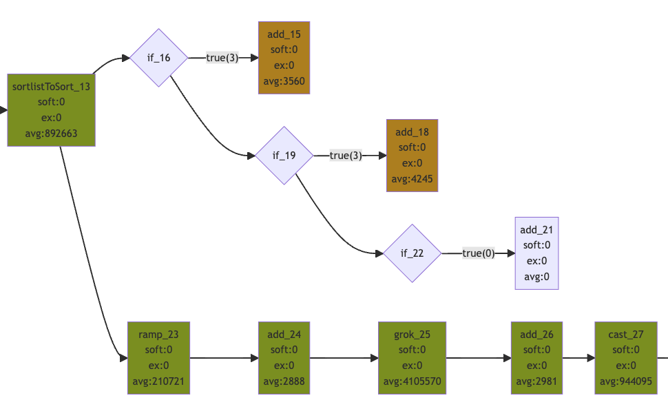

# SPEL

---
A DSL/EL designed for json transforms, configurable business logic, and appropriate for stream processing.

## Concepts

---
The idea was to allow a config-driven approach to implementing Business Logic in web and stream/batch-processing apps using a simple and fast DSL. 
Something like [Logstash](https://www.elastic.co/guide/en/logstash/current/filter-plugins.html), but with more functionality, and implemented in a way that is fully Serializable, 
incredibly fast, and easy/safe to drop into a Spring Boot webapp or [Apache Flink](https://flink.apache.org/). We also wanted a DSL that looks a lot like a Bash script, or at the 
very least is "easy on the eyes".

We also wanted a DSL that addresses the entire swath of data's lifecycle - unstructured -> structured, un-enriched -> enriched, raw -> canonical/validated, etc.
It was hard to find a DSL that handles operations like sampling, grok, deduplication, data quality checking, enrichment - so we set out to build one!

A central idea to SPEL is that in Java any event/record can be generalized into a Map<String, Object>. This is central to how SPEL works, because 
SPEL [Statements](https://github.com/hoteljuliet/SPEL/tree/main/src/main/java/io/github/hoteljuliet/spel/statements) and
[Predicates](https://github.com/hoteljuliet/SPEL/tree/main/src/main/java/io/github/hoteljuliet/spel/predicates) mostly operator over a Map<String, Object> by either modifying, 
adding, or removing values to/from the Map. A simple [CoR pattern](https://en.wikipedia.org/wiki/Chain-of-responsibility_pattern) glues the entire SPEL pipeline together.

Perhaps best of all, you can create your own Statements/Predicates, and mix/match them with the ones found here. 

SPEL is not Turing Complete by any means, but it does support a set of useful actions (called Statements) and if/else flow control with complex Predicates.

### (To see an example pipeline from the unit tests, click [here](https://github.com/hoteljuliet/SPEL/blob/main/src/test/resources/test_pipeline.yaml))

---

### Designed with an eye to Apache Flink
After building [Apache Flink](https://flink.apache.org/) jobs for a number of years using a DSL, it became obvious that the right DSL combined with FLink's Operators could do almost everything. 
In order for this to work, the DSL had to be designed with Flink's State, Checkpoints, and Metrics systems in mind. For example, the DSL elements that maintain state themselves would have to be 
fully Serializable in order to be stored in [Value State](https://nightlies.apache.org/flink/flink-docs-master/api/java/org/apache/flink/api/KCommon/state/ValueState.html) or
[List State](https://nightlies.apache.org/flink/flink-docs-master/api/java/org/apache/flink/api/KCommon/state/ListState.html). Once those design details are realized, a single 
[Process Function](https://nightlies.apache.org/flink/flink-docs-master/docs/dev/datastream/operators/process_function/) that is "driven" by a DSL pipeline can handle a number of use cases:
1. Stateless transformation - of Strings -> Maps (using grok), or Maps -> Maps and then canonicalize the events (using other DSL steps) before sinking.
2. Statelful aggregation - if both the event and the state are supplied in the Context, the DSL can modify both/either and calculate state based on events.
3. Enrichment - the DSL can set the rate of the timer, and use steps like AddS3 or AddRedis when being invoked in onTimer() to save external enrichment data to the state object.
4. Data Quality Checks - the DSL provides functionality much like [Deequ's Compliance](https://github.com/awslabs/deequ/blob/master/src/main/scala/com/amazon/deequ/analyzers/Compliance.scala) Analyzer
5. Filtering - the DSL can set a field in the Context (for example "_collect") that the Process Function pivots on to collect the event or not.
6. ML Model Inference generation - 

Other KCommon use cases can also be config-drive by a DSL: 
1. Keying - the DSL can drive a [KeySelector](https://nightlies.apache.org/flink/flink-docs-master/api/java/org/apache/flink/api/java/functions/KeySelector.html), allowing for complex and flexible key-generation logic.
2. Join - 
3. Reduce - 

---

### The SPEL Pipeline

A SPEL pipeline is a YAML document, for example:

```yaml
name: test_pipeline
stopOnFailure: true
config:
  - add: {out: "myString", in: "t"}
```
Running this pipeline would result in a Map<String, Object> that has a new field called "myString", with the value "t".

---

- ### Env Var Replacement
Statement config strings are checked for a ```${x}``` pattern, are those values are replaced with environment variables.
```yaml
  - add: {out: "user", in: "${USER}"}
```
This Statement would add the value of the Env Var "USER" to the Context.

---

- ### Metrics 
Every Statement and Predicate in the DSL generates metric about its performance - how long it takes to run, soft/hard failures, etc. Predicates report on how often they 
evaluate to true or false. We have used this small feature to very easily implement in-stream detection of complex conditions. It also makes Data Quality Checks like "Compliance"
really easy.

We implemented metrics in a way that lets the calling application provide Metrics to the DSL. It should be easy to plug into a platform's framework, like 
[Flink's Metrics Subsystem](https://nightlies.apache.org/flink/flink-docs-master/docs/ops/metrics/).

---

- ### Boolean Logic

If/else blocks let you pivot around values in the Context, for example:
```yaml
  - if:
    matches: {in: "user", regex: ".*truck*"}
    then:
      - add: {out: "matches", in: "user does not match .*truck*"}
```
Negation of a Predicate (if not)
```yaml
  - if:
    not:
      - matches: {in: "user", regex: ".*truck*"}
    then:
      - add: {out: "matches", in: "user does not match .*truck*"}
```
If/else
```yaml
  - if-fuzzyRatio:
    fuzzy-ratio: {first: "{{fuzzy1}}", second: "a string to march", ratio: 90}
    then:
      - add: {name: good, out: "fuzzyGood", in: true}
    else:
      - add: {name: bad, out: "fuzzyGood", in: false}
```

---

- ### Friendly Names
You can give your DSL elements friendly names, ex
```yaml
- if-IfFuzzyRatioIsGood:
    fuzzy-ratio: {first: "{{fuzzy1}}", second: "a string to march", ratio: 90}
    then:
      - add: {name: good, out: "fuzzy1Good", in: true}
```
will name the "if" Predicate as "IfFuzzyRatioIsGood" and the "add" Statement as "good".
Any element not given a friendly name will be given a unique name based on its type and order in the pipeline

---

- ### Mermaid Representation
The execution of a pipeline can be turned into a Mermaid Flowchart and visualized. Click 
[here](https://mermaid.live/edit#pako:eNqFWktz2zgS_isuzSWpslPEG_BhcpnavSS7VTN7WnqLxVh0rI1MuiQ6iaPSf18QDeIltPciAmDj624Q_UBDp839tB02t5uH_fTj_rE_zFef_rwbj7NtvXvnHu_fL_3X_XDlulcPu_3-9uo3c08UUXdjv912pHW_d5ZwephvG9sYfrpH__3rLaFEiOY_K4ojBZTftDCmaQCEOhCKgAhKRQZBKxDk6ubmd3h7Nz7182PHWnggqFJS0hgZgIG4JpxD9lgAzQGao1pzwk2OzAtkzy5Ac2Am3EoIBJgLrbKVEDVUHpZCAKh0oBIBZVSSDFRWFkEETOm5KFgDhaBS1nBB8jVQFWAZl8DvKO2k1dgSNCaXVteWQAVx9d34OPzsTOt-sSVggsWFdZQVUbUDBRzYcw1s_gaFJTTf-00BC6xWWYkfIaSFB7a21CidiUtqVmW5rQJbKBgCSyOYqTHCC4lpRWISjc0iWaDDvN8d539Nf9lWR1h7MYKw04ZKyQLDi2k1pcAcLzmMu4eOyJP7PVeEctPcWw8EpkYwW2NCFo5rNbYvQjtxHNjNzdV8eBnesfcLA4_oXhknizl7wsB_3Tywzwm60SnPvR7RFf6mwl-7V5Se3K_nb1b-lHq3Bp6bYptsUd6RrxyawMHOGQ_903NHWeuf2E4ljaLRXj1x8Vnrn2oFBmE5CIt5XKq1zkNE6W9X1iFKWIf79TB966ho_RP7EKQRQsW94KlrkQI87woHY-B8KeZ9qdG5P6Ol-135BcntBr7vj3NHVeufCLbh1lvGTeSJa4LD7lzRYAz2J8X2J204KcJy6YpXhkFy7aENQGPu2Aak4mvW3DHVEdja1MN0GPr7x2Uj_fPhc_987FjT1gaxfMDG1pgN1CbWZACzqrIZD8PT9H3oGGlDC-GtDI3hJxAX5l4VyVlKQF8MlvGT-z2_McMRgAaMtfB42w0wfukGmDdOBp6UoZ5UCpZ9TlYaj2MQvqYFGh9efv16_bOfd9MpNs8rP1j0MG5tZJq27fKDpZBCRREWukKAiLWqSZyaDnL80m9Ju_y8sUYZwkO_P64r5eYtEHSBoG9ALJROM0e3LApnJ_d7TvHXL8j98nOI6RyDVoLny8_p5fJzlivuEYEBOF-OOt_UxQNljUH4vhZonA_9eNz389Bx0aYdLKVWhkQXnE6oWCWHvZTBWmd02O7Gfr-bXzsu27yLcW2kTblJ4kHTSQXnTChwpxkLEE3BWirUVpTJ11JdONVMhrCo1m1_G15vvvf7FyuBbtMOGjXt6SxwSyfUFhX8eAYLL8CbczS5pkUWzEtvnnEOCpn0hWjatIMevAw1FYVEzXdzUygkltPD69_679NhNw__mH60WQ-NG5Qlp7JsCqqnAD-c44_j9KMTtIUHmqErFb8ZkJYnoEyEhY9HBAYMGGAOnzC763MGZcLmuQZk74gE-AmB-glZ-AnBa8DRUVik8b_Habx56p87IdqkjQlPGk6b6O6SGbVDLfiJFBbGIWcTeM5WHA1E6QtSvkEb6ceXeNwJ1aYdTB_NpGlydfyMmj4y6rPirknAMvjJjg2WTLe1QeyM1hhlVJkYZTNryq9SJulRzm187I-PnbAHc3hi-90IpqP_8MT11CgXyp19PfbYH0EiaY_soYktOjdJuh_Jy5wBY5owGPvn52HcdtIettYWylUkh_pAXX7mKI1jFUChmAKpgESdh2K5K5YXpbTAN9R7fBYgIVGU6FHPNHltStaO75JG4LWaJn05TeL1NKUl4XkxSfIafFJRkz7DlZCeSjQ9tUE-F7xaVZMxQZVrXc0X1tD0QckSulZbk0lxzacJEtIEiaYJTeKjgbIGHNMD6U91Ek51ErN2YooCkKzlAjKe6aTPAiRkARI90xmRJzaydqaTMf5bpHE_Td9enm92nWrapI2eSE1ScUzoa4wg-KegblxBVUQRNJmhuetXpYWmfFddlLdPBfapKJqQsXy_qFqpW0XjVN44FRinwo2zKKGrmnGqaJzKx3QFMV2hMZ0W-aqqmaWKMd0ijV8k75Ro4YF-TJKsNJDWkMEqPRQgS0CW-HElOY8CaYHs2QVk6aOVUq1_4rlukhp42hq4jOFJQeY-bG-g61L32EPjouIizQ2ySWXR1gvi890EfNwO-93Tbu6UaWMTvX4wipDo5eOEy0Q3kWXhmmAHlrppYxMrYTVSNxcMdWnSiSQpN72cPY9_P9hD2WFx4h9PWe-cygLH6vR1qOBo2obWW2WSdHJeLonTl2By_zgcP57WxrmYuUYw99LfPEAI02gIU6K4FKmEMId3ecq3oDbvnj-vYiXtc5znk_3wyssFTl-jyVtj8kKeNhcZf4CsiOZL5QacskHvQwTJ1TcEZxM8kYF6mXH1MsPPK6-1vmJ8_mDAt5r_UyEzlQqZnTM-7A7H-dPwfdh_PCXts58ECXIc9zwhszDyrYpTnFThbF3Wcbifxq1nnXZWVcEJpW_8C0gSjH6Dezqrwl4vxjP2T0NHmqX-uTbRy46GmaQCupKXKXdU2Vc-A66_8fL3Ww2aAXOuiiu5MsQm3OPFnDXcw_QyLk3WhhamjaGcxfwskFfv6CDmRkg_zL0iaODlxT2oJS0VCXyjHnyZctg926ZoQwu9a9XJBXmgrqoBGzki-mHp1UCDMaWsUKMMxpFvVGO9w2uUx8cP0Kq4xWtUVX6ZoK9_bWj8FV2DZ8u0vODVVXSVoFvTsKZz38-2bdrYRDfTsptiCTLQVxlBtE1A4f8c69Xg5nrztISZ3XZzuzndjVdXd5v5cXga7ja3trkdHvqX_Xy3uRvPlrR_mae_Xsf7za0raF9vXp63Nkz9seu_HvqnMPrcj_-eJttfnIDrbm5Pm5-b2xvCWPNBN1pI-_mIsst1vXnd3BImP9hcQlMuGq4FFefrzS-HYD7YDcFt2BBcUS0Zu94M2908HT7DX1XcP1bO_wOrZnrV)
for a full example.



---

- ### Mustache Templates
- ### Fully Serializable
- ### Complex/Stateful Statements
  - #### Clearing State
  - #### Deduplication
  - #### Sorting
  - #### KMeans 
  - #### Cardinality

---

## Installation
### As of September 2023, we're in Maven Central!
```
<dependency>
  <groupId>io.github.hoteljuliet.spel</groupId>
  <artifactId>spel</artifactId>
  <version>0.0.1</version>
</dependency>
```

---

## Design Goals and Rules:
* https://en.wikipedia.org/wiki/Principle_of_least_astonishment
1. Keep everything fast! Steps are measured in nanos, pipelines in millis. A decent sized pipeline of 50-100 Steps should run under 100 ms. 
2. Steps should be easy to add, just the logic of the new step. Minimize boilerplate code in the actual steps. Leverage base classes + Jackson serializer.
3. Keep the steps atomic - they should just do one thing, and do it very well.
4. As much as possible, a pipeline should look like a bash script in yaml format
5. Keep the names of steps and parameters short
6. Keep the naming of parameters:
    1. logical, the yaml file should read like simple spoken english - ex: "if value in list"
    2. consistent and simple: in, out, to, from, dict, list, action
7. Make more, smaller steps vs bigger ones with lots of options. ~50 lines for a stepBase is normal/average.
8. Use jackson annotations for all parsing rules, optional fields, etc
9. The Pipeline and all Steps must be completely serializable (otherwise they can't be stored as State)
    1. All Step class attributes must be either final or transient, if transient they must be re-initialized 
10. Logging is slow, so minimal/no logging (use metrics instead). Only log at error and debug levels, never info.
11. Don't put checks for field exists/has type in each Step
    1. User should do that checking in the pipeline itself with HasFields and HasType, etc

---

## Inspiration
This project was started after years of great experience working with [Logzio Sawmill](https://github.com/logzio/sawmill), which is an awesome project and worth checking out.
